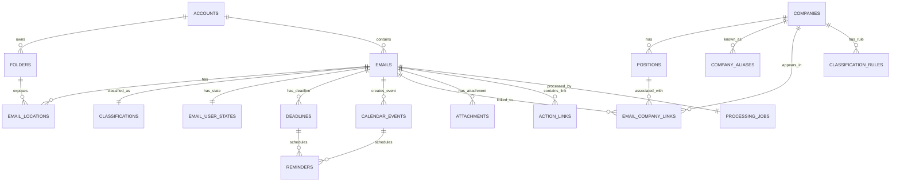

# 秋招邮件 Agent 数据模型 v0.1

> 关联需求：`docs/requirements-analysis.md`
> 数据库：SQLite，后续可通过仓储层替换为 PostgreSQL
> 时间标准：数据库统一保存 UTC ISO 8601；用户界面默认展示 `Asia/Shanghai`

## 1. 建模原则

1. **邮件与邮箱位置分离**：同一封邮件可能出现在收件箱、归档、垃圾箱等位置。
2. **公司、岗位、邮件多对多关系分离**：一封邮件可以关联一个公司和多个岗位。
3. **分类与用户状态分离**：邮件类别和“已完成”“有 DDL”“已忽略”不是同一个维度。
4. **人工结果优先**：人工确认的数据必须有来源标记，自动处理不得覆盖。
5. **可追溯**：分类、公司和 DDL 都要保留来源、置信度和原始证据。
6. **同步幂等**：重复同步不能产生重复邮件和重复位置记录。
7. **软状态优先**：删除、忽略、归档等操作保留历史，不做不可逆的物理删除。
8. **模型可替换**：规则分类和 LLM 分类都写入同一套结果表和来源字段。

## 2. 实体关系图



## 3. 核心表

### 3.1 accounts

邮箱账号及连接配置。授权码不保存在该表，只保存系统凭据管理器的引用。

| 字段 | 类型 | 约束 | 说明 |
|---|---|---|---|
| id | TEXT | PK | UUID |
| provider | TEXT | NOT NULL | 首版固定为 `163` |
| email | TEXT | NOT NULL | 邮箱地址 |
| display_name | TEXT | NULL | 用户昵称 |
| credential_ref | TEXT | NOT NULL | 系统凭据管理器中的键名 |
| imap_host | TEXT | NOT NULL | 默认 `imap.163.com` |
| imap_port | INTEGER | NOT NULL | 默认 `993` |
| smtp_host | TEXT | NOT NULL | 首版不使用 |
| smtp_port | INTEGER | NOT NULL | 首版不使用 |
| status | TEXT | NOT NULL | `active` / `disabled` / `auth_error` |
| created_at | TEXT | NOT NULL | UTC 时间 |
| updated_at | TEXT | NOT NULL | UTC 时间 |

唯一约束：`provider + email`。

### 3.2 folders

邮箱文件夹和同步游标。

| 字段 | 类型 | 约束 | 说明 |
|---|---|---|---|
| id | TEXT | PK | UUID |
| account_id | TEXT | FK | 所属账号 |
| name | TEXT | NOT NULL | 文件夹名称 |
| delimiter | TEXT | NULL | IMAP 分隔符 |
| folder_type | TEXT | NOT NULL | `inbox` / `sent` / `drafts` / `trash` / `spam` / `custom` |
| enabled | INTEGER | NOT NULL | 是否参与同步 |
| uidvalidity | TEXT | NULL | IMAP UIDVALIDITY |
| last_uid | INTEGER | NOT NULL | 已同步的最大 UID |
| sync_status | TEXT | NOT NULL | `pending` / `syncing` / `ready` / `failed` |
| last_synced_at | TEXT | NULL | 最后成功同步时间 |
| last_error | TEXT | NULL | 最近错误摘要 |
| created_at | TEXT | NOT NULL | UTC 时间 |
| updated_at | TEXT | NOT NULL | UTC 时间 |

唯一约束：`account_id + name`。

### 3.3 emails

邮件的规范化主体。一封规范化邮件只保存一次。

| 字段 | 类型 | 约束 | 说明 |
|---|---|---|---|
| id | TEXT | PK | UUID |
| account_id | TEXT | FK | 所属账号 |
| canonical_key | TEXT | NOT NULL | 优先使用 Message-ID，否则用内容哈希 |
| message_id | TEXT | NULL | RFC Message-ID |
| thread_key | TEXT | NULL | 线程键：References / In-Reply-To / 主题摘要 |
| subject | TEXT | NOT NULL | 解码后的主题 |
| from_name | TEXT | NULL | 发件人显示名 |
| from_email | TEXT | NULL | 规范后的发件地址 |
| to_json | TEXT | NOT NULL | 收件人 JSON 数组 |
| cc_json | TEXT | NOT NULL | 抄送 JSON 数组 |
| received_at | TEXT | NOT NULL | 收件时间的 UTC 值 |
| sent_at | TEXT | NULL | 邮件头中的发送时间 |
| body_text | TEXT | NULL | 纯文本正文 |
| body_html | TEXT | NULL | HTML 正文 |
| snippet | TEXT | NULL | 列表摘要 |
| raw_headers_json | TEXT | NULL | 关键邮件头 |
| has_attachments | INTEGER | NOT NULL | 是否有附件 |
| attachment_count | INTEGER | NOT NULL | 附件数量 |
| size_bytes | INTEGER | NULL | 邮件大小 |
| content_hash | TEXT | NULL | 去重和变更检测 |
| created_at | TEXT | NOT NULL | 首次导入时间 |
| updated_at | TEXT | NOT NULL | 最后更新时间 |

唯一约束：`account_id + canonical_key`。

主要索引：

- `received_at`
- `from_email`
- `message_id`
- `thread_key`

### 3.4 email_locations

邮件在某个邮箱文件夹中的位置和状态。

| 字段 | 类型 | 约束 | 说明 |
|---|---|---|---|
| id | TEXT | PK | UUID |
| email_id | TEXT | FK | 规范化邮件 |
| folder_id | TEXT | FK | 文件夹 |
| uid | TEXT | NOT NULL | IMAP UID |
| flags_json | TEXT | NOT NULL | IMAP flags |
| is_read | INTEGER | NOT NULL | 是否已读 |
| is_deleted | INTEGER | NOT NULL | 邮箱端是否已删除 |
| source_url | TEXT | NULL | 163 原文入口，如可构造 |
| first_seen_at | TEXT | NOT NULL | 首次发现时间 |
| last_seen_at | TEXT | NOT NULL | 最近发现时间 |

唯一约束：`folder_id + uid`。

索引：`email_id`、`is_read`。

### 3.5 companies

规范化公司实体。

| 字段 | 类型 | 约束 | 说明 |
|---|---|---|---|
| id | TEXT | PK | UUID |
| canonical_name | TEXT | NOT NULL | 展示名称 |
| normalized_name | TEXT | NOT NULL | 去空格、大小写和标点后的名称 |
| status | TEXT | NOT NULL | `active` / `merged` / `archived` |
| notes | TEXT | NULL | 用户备注 |
| created_at | TEXT | NOT NULL | UTC 时间 |
| updated_at | TEXT | NOT NULL | UTC 时间 |

唯一约束：`normalized_name`。

### 3.6 company_aliases

公司别名、邮箱域名和招聘系统映射。

| 字段 | 类型 | 约束 | 说明 |
|---|---|---|---|
| id | TEXT | PK | UUID |
| company_id | TEXT | FK | 公司 |
| alias_type | TEXT | NOT NULL | `name` / `domain` / `ats_sender` / `subject_pattern` |
| alias_value | TEXT | NOT NULL | 原始值 |
| normalized_value | TEXT | NOT NULL | 规范值 |
| source | TEXT | NOT NULL | `system` / `user` |
| confidence | REAL | NOT NULL | 0 到 1 |
| created_at | TEXT | NOT NULL | UTC 时间 |
| updated_at | TEXT | NOT NULL | UTC 时间 |

唯一约束：`alias_type + normalized_value`。

### 3.7 positions

公司下的岗位。

| 字段 | 类型 | 约束 | 说明 |
|---|---|---|---|
| id | TEXT | PK | UUID |
| company_id | TEXT | FK | 所属公司 |
| title | TEXT | NOT NULL | 展示岗位名称 |
| normalized_title | TEXT | NOT NULL | 归一化名称 |
| location | TEXT | NULL | 地点或工作城市 |
| status | TEXT | NOT NULL | 派生或人工确认的流程状态 |
| first_seen_at | TEXT | NOT NULL | 首次出现时间 |
| last_seen_at | TEXT | NOT NULL | 最近出现时间 |
| created_at | TEXT | NOT NULL | UTC 时间 |
| updated_at | TEXT | NOT NULL | UTC 时间 |

唯一约束：`company_id + normalized_title + location`。SQLite 中通过 `COALESCE(location, '')` 建立唯一索引。

### 3.8 email_company_links

邮件、公司和岗位之间的关联。

| 字段 | 类型 | 约束 | 说明 |
|---|---|---|---|
| id | TEXT | PK | UUID |
| email_id | TEXT | FK | 邮件 |
| company_id | TEXT | FK | 公司 |
| position_id | TEXT | FK NULL | 岗位 |
| link_type | TEXT | NOT NULL | `primary` / `mentioned` / `candidate` |
| source | TEXT | NOT NULL | `rule` / `model` / `user` / `thread` |
| confidence | REAL | NOT NULL | 0 到 1 |
| is_confirmed | INTEGER | NOT NULL | 是否人工确认 |
| evidence | TEXT | NULL | 识别证据 |
| created_at | TEXT | NOT NULL | UTC 时间 |
| updated_at | TEXT | NOT NULL | UTC 时间 |

约束：

- 每封邮件最多一个 `primary` 关联。
- 一封邮件可以关联多个岗位。
- `candidate` 用于待确认候选结果。

### 3.9 classifications

邮件的主分类结果。

| 字段 | 类型 | 约束 | 说明 |
|---|---|---|---|
| id | TEXT | PK | UUID |
| email_id | TEXT | FK UNIQUE | 每封邮件一个主分类 |
| primary_type | TEXT | NOT NULL | 六类之一或 `unclassified` |
| confidence | REAL | NOT NULL | 0 到 1 |
| source | TEXT | NOT NULL | `rule` / `model` / `user` |
| rule_id | TEXT | FK NULL | 命中的规则 |
| model_version | TEXT | NULL | 模型版本 |
| reason | TEXT | NULL | 分类依据 |
| is_manual_override | INTEGER | NOT NULL | 是否人工覆盖 |
| created_at | TEXT | NOT NULL | UTC 时间 |
| updated_at | TEXT | NOT NULL | UTC 时间 |

### 3.10 email_user_states

用户对邮件设置的状态，不修改原始邮件。

| 字段 | 类型 | 约束 | 说明 |
|---|---|---|---|
| email_id | TEXT | PK/FK | 邮件 |
| is_completed | INTEGER | NOT NULL | 是否已完成 |
| completed_at | TEXT | NULL | 完成时间 |
| is_ignored | INTEGER | NOT NULL | 是否忽略 |
| is_pinned | INTEGER | NOT NULL | 是否置顶 |
| notes | TEXT | NULL | 用户备注 |
| updated_at | TEXT | NOT NULL | UTC 时间 |

### 3.11 deadlines

截止日期记录。

| 字段 | 类型 | 约束 | 说明 |
|---|---|---|---|
| id | TEXT | PK | UUID |
| email_id | TEXT | FK | 原邮件 |
| label | TEXT | NULL | 截止事项名称 |
| due_at_utc | TEXT | NULL | 精确到时间的 UTC 值 |
| due_date_local | TEXT | NULL | 本地日期 YYYY-MM-DD |
| due_time_local | TEXT | NULL | 本地时间 HH:MM |
| precision | TEXT | NOT NULL | `date` / `datetime` |
| timezone | TEXT | NOT NULL | 默认 `Asia/Shanghai` |
| source | TEXT | NOT NULL | `auto` / `manual` |
| confidence | REAL | NOT NULL | 0 到 1 |
| status | TEXT | NOT NULL | `pending` / `completed` / `cancelled` |
| completed_at | TEXT | NULL | 完成时间 |
| is_manual_override | INTEGER | NOT NULL | 自动结果不可覆盖人工值 |
| extraction_evidence | TEXT | NULL | 日期原文片段 |
| created_at | TEXT | NOT NULL | UTC 时间 |
| updated_at | TEXT | NOT NULL | UTC 时间 |

约束：`due_at_utc` 和 `due_date_local` 至少有一个不为空。

### 3.12 calendar_events

面试、会议和其他时间事件。MVP 可以先为空，但表结构现在预留。

| 字段 | 类型 | 约束 | 说明 |
|---|---|---|---|
| id | TEXT | PK | UUID |
| email_id | TEXT | FK | 原邮件 |
| event_type | TEXT | NOT NULL | `interview` / `deadline` / `other` |
| title | TEXT | NOT NULL | 事件标题 |
| start_at_utc | TEXT | NOT NULL | 开始时间 |
| end_at_utc | TEXT | NULL | 结束时间 |
| timezone | TEXT | NOT NULL | 默认 `Asia/Shanghai` |
| location | TEXT | NULL | 地点 |
| meeting_url | TEXT | NULL | 线上会议链接 |
| source | TEXT | NOT NULL | `auto` / `manual` |
| confidence | REAL | NOT NULL | 0 到 1 |
| status | TEXT | NOT NULL | `scheduled` / `completed` / `cancelled` |
| created_at | TEXT | NOT NULL | UTC 时间 |
| updated_at | TEXT | NOT NULL | UTC 时间 |

### 3.13 attachments

附件元数据。默认只保存元信息，不自动下载正文附件。

| 字段 | 类型 | 约束 | 说明 |
|---|---|---|---|
| id | TEXT | PK | UUID |
| email_id | TEXT | FK | 邮件 |
| part_id | TEXT | NOT NULL | MIME part ID |
| filename | TEXT | NULL | 文件名 |
| mime_type | TEXT | NULL | MIME 类型 |
| size_bytes | INTEGER | NULL | 大小 |
| sha256 | TEXT | NULL | 内容哈希，下载后可计算 |
| is_inline | INTEGER | NOT NULL | 是否为内嵌资源 |
| created_at | TEXT | NOT NULL | UTC 时间 |

唯一约束：`email_id + part_id`。

### 3.14 action_links

从邮件正文中抽取出的行动链接。

| 字段 | 类型 | 约束 | 说明 |
|---|---|---|---|
| id | TEXT | PK | UUID |
| email_id | TEXT | FK | 邮件 |
| url | TEXT | NOT NULL | 原始 URL |
| normalized_url | TEXT | NOT NULL | 规范化 URL |
| link_type | TEXT | NOT NULL | `assessment` / `written_test` / `interview` / `offer` / `other` |
| label | TEXT | NULL | 链接文字 |
| domain | TEXT | NULL | URL 域名 |
| safety_status | TEXT | NOT NULL | `unknown` / `safe` / `suspicious` |
| created_at | TEXT | NOT NULL | UTC 时间 |

唯一约束：`email_id + normalized_url`。

### 3.15 classification_rules

规则分类和公司识别规则。

| 字段 | 类型 | 约束 | 说明 |
|---|---|---|---|
| id | TEXT | PK | UUID |
| name | TEXT | NOT NULL | 规则名称 |
| priority | INTEGER | NOT NULL | 越小优先级越高 |
| rule_type | TEXT | NOT NULL | `sender` / `subject` / `body` / `domain` / `thread` |
| pattern | TEXT | NOT NULL | 匹配表达式或模板 |
| target_type | TEXT | NOT NULL | `classification` / `company` / `position` / `deadline` |
| target_value | TEXT | NOT NULL | 目标值或 JSON |
| source | TEXT | NOT NULL | `system` / `user` |
| is_enabled | INTEGER | NOT NULL | 是否启用 |
| created_at | TEXT | NOT NULL | UTC 时间 |
| updated_at | TEXT | NOT NULL | UTC 时间 |

### 3.16 processing_jobs

邮件处理流水线状态，用于重试和失败恢复。

| 字段 | 类型 | 约束 | 说明 |
|---|---|---|---|
| email_id | TEXT | PK/FK | 邮件 |
| stage | TEXT | NOT NULL | `imported` / `normalized` / `linked` / `classified` / `deadextracted` / `ready` / `failed` |
| status | TEXT | NOT NULL | `pending` / `running` / `done` / `failed` |
| attempt_count | INTEGER | NOT NULL | 尝试次数 |
| last_error | TEXT | NULL | 最近错误 |
| updated_at | TEXT | NOT NULL | UTC 时间 |

### 3.17 reminders

提醒计划。

| 字段 | 类型 | 约束 | 说明 |
|---|---|---|---|
| id | TEXT | PK | UUID |
| deadline_id | TEXT | FK NULL | 截止日期 |
| calendar_event_id | TEXT | FK NULL | 日历事件 |
| channel | TEXT | NOT NULL | `in_app` / `windows` / `email` |
| offset_minutes | INTEGER | NOT NULL | 相对开始或截止时间的分钟数，可为负 |
| scheduled_at | TEXT | NOT NULL | 计划发送时间 |
| sent_at | TEXT | NULL | 实际发送时间 |
| status | TEXT | NOT NULL | `scheduled` / `sent` / `cancelled` / `failed` |
| error | TEXT | NULL | 失败原因 |
| created_at | TEXT | NOT NULL | UTC 时间 |
| updated_at | TEXT | NOT NULL | UTC 时间 |

约束：`deadline_id` 和 `calendar_event_id` 只能有一个非空。

### 3.18 settings

应用配置和用户偏好。

| 字段 | 类型 | 约束 | 说明 |
|---|---|---|---|
| key | TEXT | PK | 设置键 |
| value_json | TEXT | NOT NULL | JSON 值 |
| updated_at | TEXT | NOT NULL | UTC 时间 |

### 3.19 audit_logs

关键用户操作审计。

| 字段 | 类型 | 约束 | 说明 |
|---|---|---|---|
| id | TEXT | PK | UUID |
| entity_type | TEXT | NOT NULL | 实体类型 |
| entity_id | TEXT | NOT NULL | 实体 ID |
| action | TEXT | NOT NULL | 操作 |
| before_json | TEXT | NULL | 操作前数据 |
| after_json | TEXT | NULL | 操作后数据 |
| created_at | TEXT | NOT NULL | UTC 时间 |

## 4. 状态定义

### 4.1 邮件主分类

```text
application_received
rejected
assessment_invite
written_test_invite
interview_invite
offer
unclassified
```

### 4.2 公司或岗位流程状态

```text
submitted
application_received
assessment
written_test
interview
offer
rejected
no_response
unknown
```

流程状态的推荐派生规则：

1. 人工确认状态优先。
2. 有 Offer 时优先显示 Offer。
3. 有拒绝时，如果之后没有新进展，显示拒绝。
4. 以最近发生的有进展邮件更新状态。
5. 无法判断时显示未知，不强行推断。

### 4.3 DDL 状态

```text
pending
completed
cancelled
```

`overdue` 不落库，是相对于当前时间计算出来的展示状态。

### 4.4 处理阶段

```text
imported -> normalized -> linked -> classified -> deadextracted -> ready
                                             \-> failed
```

## 5. 关键约束和幂等规则

- 同步唯一键：`account_id + canonical_key`。
- 邮箱位置唯一键：`folder_id + uid`。
- 每封邮件只能有一个主分类。
- 每封邮件只能有一个主公司关联。
- 同一封邮件可以关联多个岗位。
- 同一封邮件可以有多条 DDL。
- 人工修改必须设置来源为 `user` 或 `is_manual_override=1`。
- 自动处理不得覆盖人工确认结果。
- 删除邮件、忽略邮件、归档邮件都应是软状态。
- DDL 的 `pending/completed` 状态和邮件本身的 `is_completed` 需要在业务层保持一致。

## 6. 后续迁移方向

- 多账号：`accounts` 已经隔离，不需要改表。
- PostgreSQL：将 TEXT 时间字段改为 `timestamptz`，并保留统一仓储接口。
- 向量检索：新增 `email_embeddings`，不修改 `emails` 结构。
- 多用户：新增 `users`、`user_accounts` 和所有实体上的 `owner_user_id`。
- 同步回 163：新增 `mailbox_actions` 表，记录 IMAP 操作意图和执行状态，不直接修改 `email_locations`。
